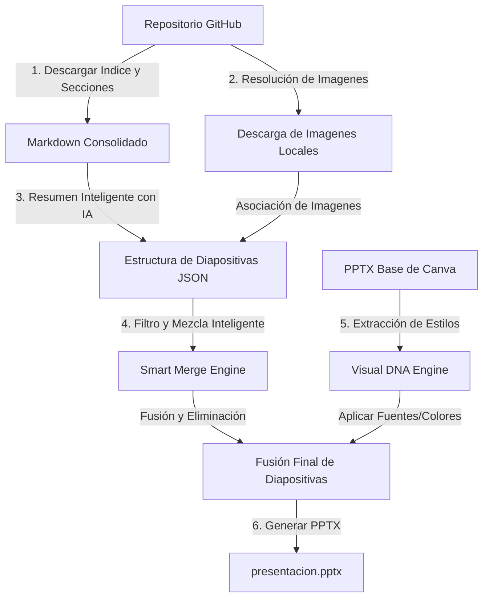

# Markdown to PPTX Automator CLI


**Markdown to PPTX Automator** es una potente herramienta de línea de comandos (CLI) escrita en Node.js y Python que convierte de forma automatizada documentación técnica Markdown alojada en GitHub en presentaciones de PowerPoint (`.pptx`) altamente estructuradas mediante Inteligencia Artificial.

El núcleo de la herramienta está optimizado para flujos de trabajo profesionales mediante el enfoque **Canva-PPTX-Canva Bridge**, que permite fusionar diapositivas estáticas complejas diseñadas por humanos en Canva (como carátulas, integrantes y contexto) con contenido técnico y diagramas generados dinámicamente por la IA a partir de un repositorio de código. Todo esto se integra directamente en Canva de forma gratuita sin necesidad de APIs de pago.

---

## 🚀 Características Clave

* **Canva Template Bridge (Puente Canva-PPTX-Canva)**: Utiliza tus mejores diseños de Canva. Solo expórtalos como `.pptx`, indica la ruta en la consola y la herramienta se encargará del resto: actualiza automáticamente el título principal y añade el contenido técnico al final.
* **Lógica de Limpieza Inteligente (Smart Merge)**: En lugar de procesos rígidos, tú decides manualmente qué diapositivas del diseño base conservar (ej. `1-3` para la carátula, equipo y contexto, o listados específicos tipo `1,2,4`). La herramienta elimina automáticamente las diapositivas vacías o placeholders redundantes y concatena las nuevas diapositivas técnicas de la IA de manera limpia.
* **Extracción de Estilo de Plantilla (Visual DNA)**: Para que el nuevo contenido generado por IA no desentone, el script de Python analiza el PPTX base y extrae:
  * Color de fondo (sólido o el color dominante del fondo).
  * Tipografías de títulos y cuerpo (familias de fuentes originales).
  * Paleta de colores aplicada a textos.
  Luego, las nuevas diapositivas heredan exactamente este "DNA Visual".
* **Validación Temprana ("Fail-Fast")**:
  * **Comprobación local de ruta**: Permite arrastrar y soltar (Drag & Drop) el archivo en terminal, limpia caracteres basura como `& '` y valida la existencia del archivo inmediatamente.
  * **Verificación de Bloqueo (EBUSY)**: Detecta si el archivo base o de salida está abierto en PowerPoint o Canva antes de iniciar el procesamiento, previniendo fallos inesperados.
  * **Validación de GitHub**: Realiza una consulta rápida a la API de GitHub al introducir el repositorio y la rama para asegurar que el token y los datos de acceso sean válidos antes de proceder.
* **Consola Visual "Zero-Scroll"**: Interfaz ultra limpia basada en `@clack/prompts`. Los procesos masivos (como la descarga e indexación de múltiples imágenes de documentación) se muestran en un spinner persistente en una sola línea que se actualiza dinámicamente.
* **Caché de Resiliencia Local**: Guarda el estado de la descarga en `.cache_payload.json`. Si necesitas ajustar el tema, cambiar de modelo de IA o reordenar diapositivas, puedes reanudar el flujo al instante sin volver a consumir la API de GitHub o volver a descargar recursos.

---

## ⚙️ Flujo de Trabajo Inteligente (Intelligent Workflow)

El pipeline de ejecución se divide en fases claras y secuenciales:



1. **GitHub to Local Cache**: Descarga la estructura y recursos multimedia asociando de forma lógica las capturas de pantalla de la documentación con los temas de las diapositivas correspondientes.
2. **AI Expert Review (Doble Pasada)**:
   * **Pasada 1**: Un primer agente de Gemini extrae y sintetiza el contenido técnico en formato de viñetas claras.
   * **Pasada 2**: El agente de revisión actúa como un experto en la materia de la presentación (ej. Ingeniería de Software, Diseño de Experimentos) para dar rigor profesional y fluidez al texto.
3. **Bridge Merge**: El motor de Python abre el archivo base, elimina las diapositivas que no se seleccionaron para conservar, actualiza el título del archivo base manteniendo la tipografía exacta y añade las nuevas diapositivas técnicas de forma uniforme.

---

## 📋 Requisitos Previos

Necesitarás disponer de:
1. **Node.js**: Versión 18.0.0 o superior instalada.
2. **Python**: Versión 3.9 o superior con el paquete `python-pptx` y `Pillow` instalados:
   ```bash
   pip install python-pptx pillow
   ```
3. **GitHub Personal Access Token (PAT)** con permisos de lectura (`repo`).
4. **Gemini API Key** desde [Google AI Studio](https://aistudio.google.com/).

---

## 📦 Instalación y Configuración

1. **Clona** el repositorio:
   ```bash
   git clone https://github.com/tu-usuario/MarkdownToPptxAutomator.git
   cd MarkdownToPptxAutomator
   ```
2. **Instala** las dependencias de Node.js:
   ```bash
   npm install
   ```
3. **Configura** las variables de entorno duplicando `.env.example` a `.env`:
   ```bash
   cp .env.example .env
   ```
   Abre `.env` y rellena las credenciales correspondientes:
   ```env
   GITHUB_TOKEN=tu_personal_access_token_de_github
   GEMINI_API_KEY=tu_api_key_de_gemini
   ```

---

## 🎮 Demostración Visual de Consola

Así se ve el flujo de ejecución interactivo en terminal:

```text
┌  Markdown to PPTX Automator CLI
│
▲  Ruta del PPTX base exportado de Canva (Tip: Arrastra y suelta el archivo aquí, o presiona Enter para omitir):
│  C:\Rutas\plantilla_canva.pptx
│
│  1. Introduce el repositorio de GitHub (owner/repo): owner/repo
│  2. Rama del repositorio: main
│
│  ✔ Validando repositorio y rama en GitHub... [OK] Repositorio y rama validados con exito.
│
│  3. Ruta del archivo indice (Tabla de Contenidos): 00-cover.md
│  4. Titulo de la presentacion: Sistema de Monitoreo IoT
│  5. ¿Para que curso o tematica es esta presentacion? (Ej. Diseno de Experimentos, Ingenieria de Software): IoT y Redes
│  6. Seccion de inicio en el indice: 3.1
│  7. Seccion de fin en el indice: 4.2
│
│  Se detecto una plantilla base. ¿Deseas que las nuevas diapositivas hereden su estilo visual? (S/N) Si
│  ¿Qué diapositivas de tu plantilla base deseas conservar intactas? (Ej. ingresa '1-3' para conservar la carátula, equipo y contexto, o '1,2,4'): 1-3
│
│  Selecciona el Motor de IA (AI Engine):
│  ● Gemini 1.5 Flash (Recomendado) - Rapido y economico. Promedio: ~$0.003 USD por PPTX.
│  ○ Gemini 1.5 Pro - Mayor razonamiento, ideal para logica compleja. Promedio: ~$0.15 USD por PPTX.
│
│  GitHub [Repository]  ---> [EXTRACTING] ---> Local Cache
│
│  ✔ Indice cargado. Se encontraron 15 secciones.
│  ✔ Contenido extraido. Largo: 18230 caracteres. Imagenes detectadas: 4.
│  ✔ Sincronizando multimedia: [4/4] imagenes procesadas...
│  ✔ Estado guardado en cache local (.cache_payload.json).
│
│  Local Cache [Data]   ---> [PROCESSING] ---> AI Expert Review
│
│  ✔ Gemini completo el analisis. Se estructuraron 8 diapositivas.
│
│  AI Expert [Dynamic]   ---> [INHERITING STYLE] ---> Final Merge
│
│  [FILE] PPTX base cargado en memoria desde: C:\Rutas\plantilla_canva.pptx
│  [EDIT] Título de la carátula actualizado a: Sistema de Monitoreo IoT
│  Canva Template [BASE] ---> [EXTRACTING STYLE] ---> Style Engine
│  [DNA] Estilo extraído: Fondo=FFFFFF, Título=Montserrat ExtraBold, Cuerpo=Inter
│  User Selection [KEEP] ---> [CLEANING SLIDES]  ---> Static Slides Ready
│  [APPEND] Añadiendo 8 diapositivas dinámicas al final de la presentación...
│  AI Expert [Dynamic]   ---> [INHERITING STYLE] ---> Final Merge
│
│  ✔ Presentacion PowerPoint generada.
│
│  [TOKENS] Consumo de la API de Gemini:
│  - Tokens de prompt (entrada): 8450
│  - Tokens de respuesta (salida): 1520
│  - Tokens totales: 9970
│  - Costo estimado de esta presentacion: ~$0.000780 USD (Calculado con tarifas de Gemini 1.5 Flash)
│
└  [SUCCESS] Presentación generada exitosamente. Arrastra presentacion.pptx a Canva para edición colaborativa en equipo.
```

---

## 📂 Estructura del Código

* **`src/index.js`**: El orquestador principal. Valida parámetros de caché, orquesta la descarga, invoca los agentes de LLM y genera el PowerPoint.
* **`src/cli.js`**: Wizard interactivo con prompts contextuales, limpieza de rutas (Drag & Drop en Windows/POSIX) y validación fail-fast.
* **`src/github.js`**: Conector de API de GitHub para descargar el archivo de índice y parsear las secciones seleccionadas.
* **`src/llm.js`**: Contiene la lógica del agente y la plantilla del prompt estructurado en doble pasada.
* **`src/pptx.js`**: Interfaz de Node.js que spawnea el script de Python y maneja el bucle de reintento si el archivo está bloqueado por el usuario (`EBUSY`).
* **`src/pptx_editor.py`**: Motor en Python que manipula el PPTX usando `python-pptx`:
  * Modifica el título de la carátula.
  * Realiza el borrado en orden inverso de las diapositivas no seleccionadas.
  * Extrae tipografías y colores (Visual DNA).
  * Genera e inyecta diapositivas con maquetación inteligente de títulos, viñetas e imágenes escaladas.
* **`src/utils.js`**: Funciones auxiliares para la descarga asíncrona de recursos, renombrado de archivos e interacciones del sistema.

---

## 🤝 Contribución y Licencia

Este proyecto está bajo la Licencia **MIT**. Las contribuciones son bienvenidas mediante Pull Requests e Issues en el repositorio.
