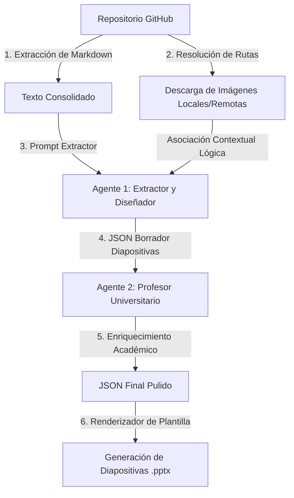

# Markdown to PPTX Automator CLI


Markdown to PPTX Automator es una potente herramienta de interfaz de línea de comandos (CLI) escrita en Node.js que convierte de forma automatizada documentación técnica en formato Markdown alojada en GitHub en presentaciones de PowerPoint (`.pptx`) estilizadas y estructuradas por Inteligencia Artificial.

El principal objetivo de la herramienta es optimizar la creación de diapositivas para reuniones, exposiciones o entregas de proyectos, permitiendo a los desarrolladores y equipos pasar de documentos técnicos densos a presentaciones profesionales en minutos, con la opción de importarlas en **Canva** de forma 100% gratuita.

---

## 🚀 Características Pro (Pro Features)

* **Asistente de Configuración (Setup Wizard)**: Permite seleccionar interactivamente el Motor de IA (Gemini 1.5 Flash vs Gemini 1.5 Pro con costos estimados) y el Tema de Diseño de las diapositivas al arrancar.
* **Temas Visuales Dinámicos**: Soporte dinámico para 3 estilos de presentación:
  * *Clásico Académico*: Fondo blanco, textos oscuros y acentos en azul real.
  * *Minimalista SaaS (Modo Oscuro)*: Fondo carbón/oscuro, textos claros y acentos en morado y cian neón.
  * *Corporativo*: Fondo gris claro, textos gris oscuro y acentos en verde esmeralda.
* **Pipeline de Doble Pasada (Multi-pass Pipeline)**: Implementa un flujo multi-agente donde un primer agente extrae y estructura las diapositivas, y un segundo agente (el "Profesor Revisor") actúa como experto académico en la temática indicada para enriquecer textos y dar un tono profesional.
* **Consola Visual "Zero-Scroll"**: Interfaz limpia que actualiza el progreso en una sola línea mediante spinners interactivos, evitando inundar la terminal de logs innecesarios.
* **Caché de Resiliencia (Resume/New)**: Guarda estados de descarga de texto e imágenes en `.cache_payload.json` permitiendo reanudar o reconfigurar aspectos estéticos instantáneamente sin consumir APIs externas ni re-descargar de GitHub.
* **Resiliencia ante Errores 503/429**: Implementa *Exponential Backoff* y rotación inteligente de modelos de Gemini en caso de alta demanda.
* **Manejo Definitivo de Archivos Bloqueados (EBUSY)**: Si el archivo final `.pptx` está abierto en otro programa, la consola pausará y esperará la entrada del usuario de manera no bloqueante en lugar de abortar o renombrar incorrectamente.
* **Salida Limpia y Segura (SIGINT)**: Captura interrupciones (Ctrl+C) de forma elegante para limpiar recursos temporales (`temp_assets` y archivos `.tmp`) y terminar de forma adecuada.

---

## ⚙️ Intelligent Workflow (Doble Pasada)

La herramienta implementa un pipeline de doble pasada para asegurar el máximo rigor académico y alineación visual:



1. **Pasada 1 (Agente Extractor)**: Procesa la documentación y la lista de imágenes garantizando una asociación contextual lógica y directa (ej. asociar la imagen de interfaz al slide de UI).
2. **Pasada 2 (Profesor Revisor)**: Adopta la identidad de un experto universitario en la materia elegida por el usuario para expandir viñetas escuetas, pulir términos y añadir rigor académico sin inventar funcionalidad técnica ni alterar el mapeo de imágenes.

---

## 📋 Requisitos Previos

Necesitarás disponer de:
1. **Node.js**: Versión 18.0.0 o superior instalada.
2. **GitHub Personal Access Token (PAT)** con permisos de lectura (`repo`).
3. **Gemini API Key** desde [Google AI Studio](https://aistudio.google.com/).

---

## 📦 Instalación y Configuración

1. **Clona** el repositorio:
   ```bash
   git clone https://github.com/tu-usuario/MarkdownToPptxAutomator.git
   cd MarkdownToPptxAutomator
   ```
2. **Instala** las dependencias:
   ```bash
   npm install
   ```
3. **Configura** las variables de entorno duplicando `.env.example` a `.env`:
   ```bash
   cp .env.example .env
   ```
   Llena las variables de entorno en el archivo `.env`:
   ```env
   GITHUB_TOKEN=tu_personal_access_token_de_github
   GEMINI_API_KEY=tu_api_key_de_gemini
   ```

---

## 🎮 Demostración Visual de Consola

Así se ve el flujo de ejecución interactivo en terminal:

```text
Markdown to PPTX Automator CLI

[INFO] Se detectó información local de: owner/repo (Secciones 5.1 a 6.1.1).

Selecciona el Motor de IA (AI Engine):
● Gemini 1.5 Flash (Recomendado) - Rápido y económico. Promedio: ~$0.003 USD por PPTX.
○ Gemini 1.5 Pro - Mayor razonamiento, ideal para lógica compleja. Promedio: ~$0.15 USD por PPTX.

Selecciona el Tema de Diseño para el PPTX:
● Clásico Académico: Fondo blanco, texto negro, acentos en azul oscuro.
○ Minimalista SaaS: Diseño en modo oscuro (fondo dark/carbón), texto blanco, con acentos en morado y cian neón.
○ Corporativo: Fondo gris claro, texto gris oscuro, acentos en verde esmeralda.

GitHub [Repository]  ---> [EXTRACTING] ---> Local Cache

✔ Índice cargado. Se encontraron 12 secciones.
✔ Contenido extraído. Largo: 25430 caracteres. Imágenes detectadas: 3.
⠋ Sincronizando multimedia: [3/3] imágenes procesadas...
✔ Multimedia sincronizada. Procesadas 3 imágenes.

Local Cache [Data]   ---> [PROCESSING] ---> AI Expert Review

[EXPERT] El modelo gemini-1.5-flash está revisando y elevando el nivel académico de tus diapositivas...

✔ Gemini completó el análisis. Se estructuraron 10 diapositivas.

AI Expert [Final]    ---> [RENDERING]  ---> presentacion.pptx

⠋ Procesando diapositiva 10 de 10...
✔ Presentación PowerPoint generada.

[TOKENS] Consumo de la API de Gemini:
- Tokens de prompt (entrada): 14205
- Tokens de respuesta (salida): 2304
- Tokens totales: 16509
- Costo estimado de esta presentación: ~$0.001756 USD (Calculado con tarifas de Gemini 1.5 Flash)

Proceso completado con éxito. La presentación se guardó como: presentacion.pptx
```

---

## 📂 Estructura de Código

* **`src/index.js`**: El orquestador principal. Maneja hooks de señales (SIGINT), transiciones de flujo en la terminal y cálculo del reporte de costos en USD.
* **`src/cli.js`**: Setup Wizard interactivo y recuperación ágil de caché local.
* **`src/github.js`**: Conector con GitHub API, parseador de markdown y extractor de imágenes.
* **`src/llm.js`**: Pipeline multi-agente de doble pasada con reintentos.
* **`src/pptx.js`**: Generador gráfico de diapositivas 16:9 con control anti-bloqueo EBUSY y temas dinámicos.
* **`src/utils.js`**: Gestor de descarga asíncrona silenciosa de multimedia con Exponential Backoff.

---

## 🤝 Contribución y Licencia

Este proyecto está bajo la Licencia **MIT**. Las contribuciones son bienvenidas mediante Pull Requests e Issues en el repositorio.
